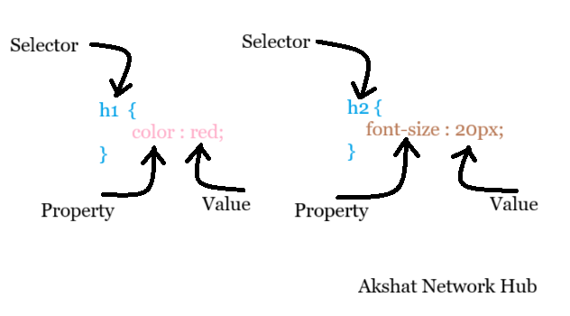

# CSS Tutorial - Level 1 (Basic)
## CSS
<h3 style="color: red;">Cascading Style Sheet</h3>
It is a language that is used to describe the style of a document.

## Basic Syntax
<br>


## Selector :
Selector select elements like &lt;h&gt; , &lt;p&gt; , etc on which the given style within it must be apply. Basically , Selector is either a html tags or it can be a class of any html tag declared using :
```css
.class_name {
    /* Insert your style here */
}
```

## Emmet :
Emmet is a special feature in code editor like VS code that use multiple short code store within its database to generate huge code automatically .

For Example: Type Exclamatory sign and click enter 
```html
!
``` 

It will create a boiler plate code as given below :
```html
<!DOCTYPE html>
<html lang="en">
<head>
    <meta charset="UTF-8">
    <meta name="viewport" content="width=device-width, initial-scale=1.0">
    <title>Document</title>
</head>
<body>
    <!-- Our html content go there -->
</body>
</html>
```

## Property
First we described the type of property (say font-size , color , font-style , text-align , etc) of a selected Selector . This property describe what nature of selected element must be undergo style.

<table border="1" cellpadding="8">
<tr>
<th>Property</th>
<th>Explanation</th>
</tr>
<tr>
<td>color</td>
<td>The value within this property define the foreground color of the element.</td>
</tr>
<tr>
<td>background-color</td>
<td>The value within this property define the background color of the element.</td>
</tr>
<tr>
<td>font-size</td>
<td>The value within this property define the font-size (literally , the size of the font) of the given element.</td>
</tr>
<tr>
<td>text-align</td>
<td>The value within this property define the positioning alignment of the selected element i.e., left , right and center.</td>
</tr>
<tr>
<td>font-style</td>
<td>The value within this property define the styling font of the selected element i.e., italic , arial , oblique , etc .</td>
</tr>
</table>


## Type of Including CSS Style
We can apply CSS Properties to our html document by using 3 ways :

<h3>Inline CSS - </h3>

In this type of css , we describe css property inside the tags as shown below :
```html
<h1 style="color:red"> Akshat Network Hub </h1>
```

<h3>Internal CSS - </h3>

In this type of css , we describe css property in the head section of our html document using **style** tags as given below :
```html
<!DOCTYPE html>
<html lang="en">
<head>
    <meta charset="UTF-8">
    <meta name="viewport" content="width=device-width, initial-scale=1.0">
    <title>CSS Level - 1</title>
</head>
<!-- Our Internal Style is written here -->
 <style>
    h1 {
        color: red;
    }
 </style>
<body>
<!-- This heading appear to be red -->
    <h1>Hello by Akshat Network Hub</h1>
</body>
</html>
```

<h3> External CSS - </h3>

In this type of css injection , we created seperate html and css file and link our html file with our css file by pasting the syntax given below in our head section of our html :

```html
<link rel="stylesheet" href="style.css">
```

Steps :

1. Create index.html or any html file with .htm / .html extension.

```html
<!DOCTYPE html>
<html lang="en">
<head>
    <meta charset="UTF-8">
    <meta name="viewport" content="width=device-width, initial-scale=1.0">
    <title>CSS Level - 1</title>
</head>
<!-- Our External Style Sheet link is added here -->
<link rel="stylesheet" href="style.css">
<body>
<!-- This heading appear to be red -->
    <h1>Hello by Akshat Network Hub</h1>
</body>
</html>
```

2. Now let you want to change h1 color to red, font-size to 12px and font-weight to bold , We will create seperate external css file with exact name "style.css" as we add link in html .
```css
h1 {
    color: red; /*-- Can write different colors or colors code or rgba value --*/
    font-size: 12px; /*-- We can customize font-size i.e., the height of text display in web as per our need --*/ 
    font-weight: bold; /*-- More option include italic , initial , inherit , etc --*/
}
/*-- All style go there --*/
```

## Property and their Style Implementation in detail :

### 1. Color : 
It is a property in css that change or set the <b style="color: blue;">foreground</b> color of the selected element in html and display the result in our webpage .
```css
/*
color: red;
color: pink;
color: blue;
color: green;
It set the foreground color say color of text , link , button 
*/
```

### 1. Background Color : 
It is a property in css that change or set the <b style="color: blue;">background</b> color of the selected element in html and display the result in our webpage .
```css
/*
background-color: red;
background-color: pink;
background-color: blue;
background-color: green;
It set the background color say color visible behind the text , button text , link text or the overall body element. 
*/
```
### Color picker : 
VS Code provide a feature of selecting color from color picker and apply customized color to our element .